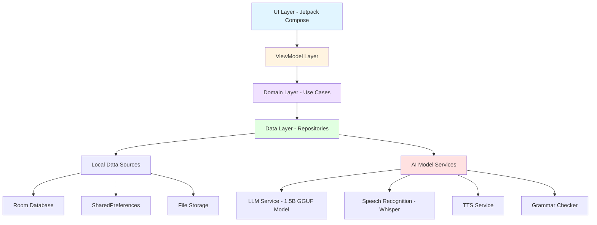

# 系统架构

## 架构图



## 架构层次

### UI Layer (Jetpack Compose)
- 负责渲染用户界面
- 处理用户交互事件
- 观察ViewModel状态变化
- 管理页面导航

### ViewModel Layer
- 管理UI状态
- 协调Use Cases执行
- 处理异步操作
- 生命周期感知

### Domain Layer (Use Cases)
- 封装业务逻辑
- 实现单一业务功能
- 协调多个Repository
- 处理业务规则验证

### Data Layer (Repositories)
- 提供数据访问抽象层
- 统一数据访问接口
- 协调本地和远程数据源
- 实现数据缓存策略

### Local Data Sources
- Room Database: 结构化数据存储
- SharedPreferences: 用户偏好设置
- File Storage: 音频文件和模型文件

### AI Model Services
- LLM Service: 本地大语言模型推理
- Speech Recognition: Whisper语音识别
- TTS Service: 文本转语音
- Grammar Checker: 语法检查服务

## 数据流

### 单向数据流 (UDF)
```
User Action → ViewModel → Use Case → Repository → Data Source
                ↓
            UI State Update
                ↓
            UI Recomposition
```

### 状态管理
- 使用 StateFlow 管理UI状态
- 使用 SharedFlow 处理一次性事件
- 使用 remember 缓存计算结果
- 使用 derivedStateOf 优化状态派生

## 依赖注入

使用 Hilt 进行依赖注入：
- AppModule: 应用级依赖
- DatabaseModule: 数据库相关依赖
- AIModule: AI服务相关依赖
- ViewModelModule: ViewModel依赖（自动生成）

## 线程模型

- **Main Thread**: UI渲染和用户交互
- **IO Dispatcher**: 数据库操作和文件I/O
- **Default Dispatcher**: CPU密集型计算（AI推理）
- **Unconfined Dispatcher**: 不限制线程的协程
