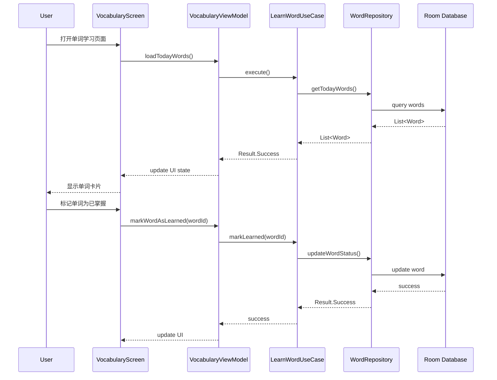
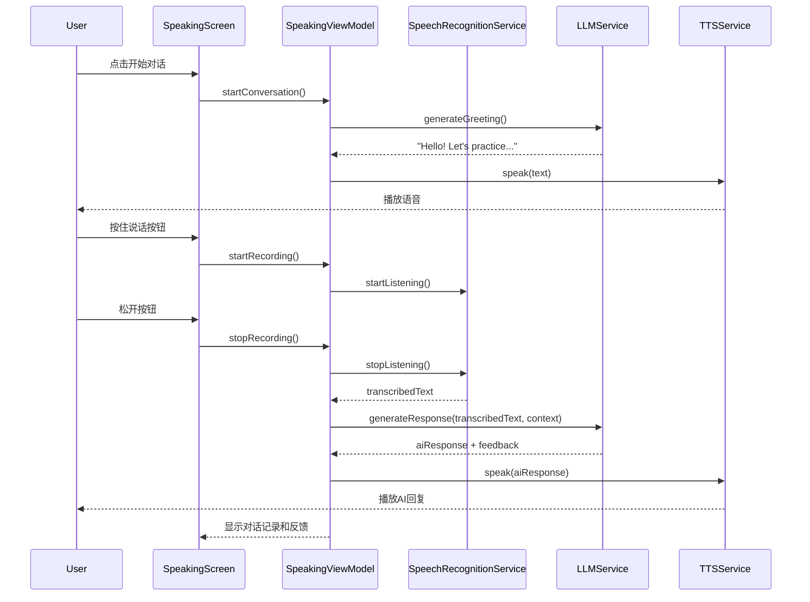
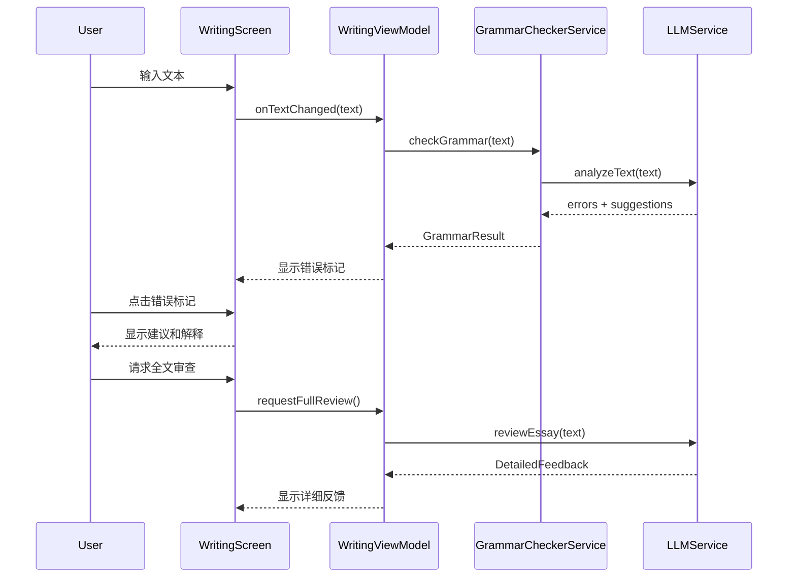
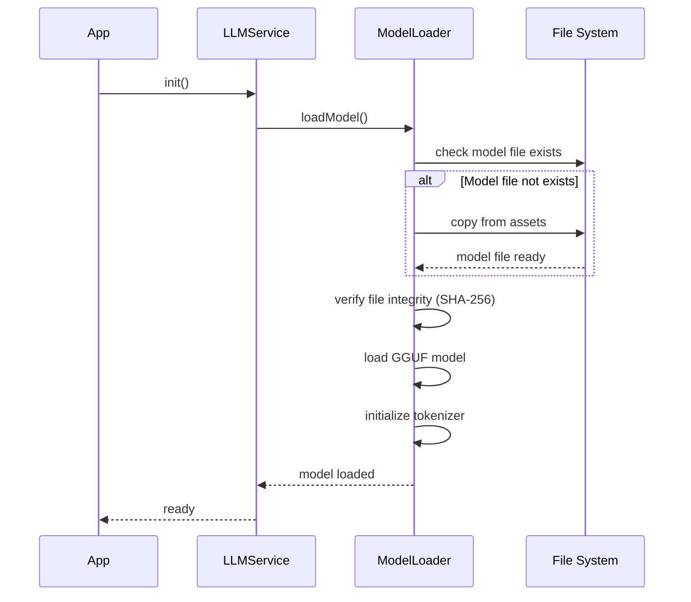

# 主要工作流程

## 单词学习流程

```mermaid
sequenceDiagram
    participant User
    participant UI as VocabularyScreen
    participant VM as VocabularyViewModel
    participant UC as LearnWordUseCase
    participant Repo as WordRepository
    participant DB as Room Database
    
    User->>UI: 打开单词学习页面
    UI->>VM: loadTodayWords()
    VM->>UC: execute()
    UC->>Repo: getTodayWords()
    Repo->>DB: query words
    DB-->>Repo: List<Word>
    Repo-->>UC: List<Word>
    UC-->>VM: Result.Success
    VM-->>UI: update UI state
    UI-->>User: 显示单词卡片
    
    User->>UI: 标记单词为已掌握
    UI->>VM: markWordAsLearned(wordId)
    VM->>UC: markLearned(wordId)
    UC->>Repo: updateWordStatus()
    Repo->>DB: update word
    DB-->>Repo: success
    Repo-->>UC: Result.Success
    UC-->>VM: success
    VM-->>UI: update UI
```

## AI口语训练流程

```mermaid
sequenceDiagram
    participant User
    participant UI as SpeakingScreen
    participant VM as SpeakingViewModel
    participant ASR as SpeechRecognitionService
    participant LLM as LLMService
    participant TTS as TTSService
    
    User->>UI: 点击开始对话
    UI->>VM: startConversation()
    VM->>LLM: generateGreeting()
    LLM-->>VM: "Hello! Let's practice..."
    VM->>TTS: speak(text)
    TTS-->>User: 播放语音
    
    User->>UI: 按住说话按钮
    UI->>VM: startRecording()
    VM->>ASR: startListening()
    User->>UI: 松开按钮
    UI->>VM: stopRecording()
    VM->>ASR: stopListening()
    ASR-->>VM: transcribedText
    
    VM->>LLM: generateResponse(transcribedText, context)
    LLM-->>VM: aiResponse + feedback
    VM->>TTS: speak(aiResponse)
    TTS-->>User: 播放AI回复
    VM-->>UI: 显示对话记录和反馈
```

## 写作练习流程

```mermaid
sequenceDiagram
    participant User
    participant UI as WritingScreen
    participant VM as WritingViewModel
    participant Grammar as GrammarCheckerService
    participant LLM as LLMService
    
    User->>UI: 输入文本
    UI->>VM: onTextChanged(text)
    VM->>Grammar: checkGrammar(text)
    Grammar->>LLM: analyzeText(text)
    LLM-->>Grammar: errors + suggestions
    Grammar-->>VM: GrammarResult
    VM-->>UI: 显示错误标记
    
    User->>UI: 点击错误标记
    UI-->>User: 显示建议和解释
    
    User->>UI: 请求全文审查
    UI->>VM: requestFullReview()
    VM->>LLM: reviewEssay(text)
    LLM-->>VM: DetailedFeedback
    VM-->>UI: 显示详细反馈
```

## 模型加载流程

```mermaid
sequenceDiagram
    participant App
    participant LLM as LLMService
    participant Loader as ModelLoader
    participant FS as File System
    
    App->>LLM: init()
    LLM->>Loader: loadModel()
    Loader->>FS: check model file exists
    
    alt Model file not exists
        Loader->>FS: copy from assets
        FS-->>Loader: model file ready
    end
    
    Loader->>Loader: verify file integrity (SHA-256)
    Loader->>Loader: load GGUF model
    Loader->>Loader: initialize tokenizer
    Loader-->>LLM: model loaded
    LLM-->>App: ready
```
