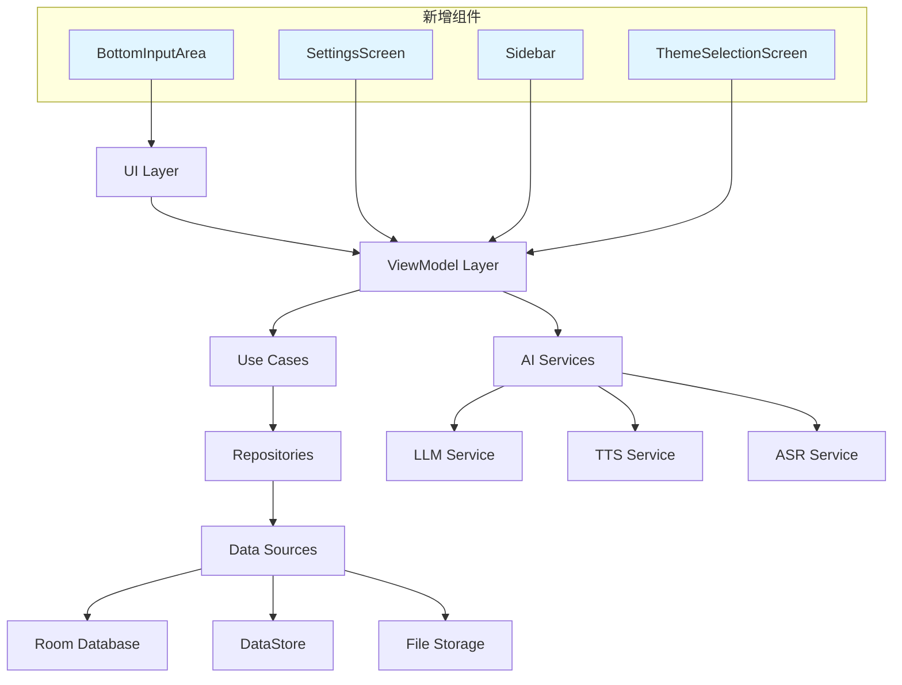

# 组件和接口

## UI Layer - Jetpack Compose Screens

### 目的
提供用户界面和交互逻辑

### 界面组件

```kotlin
// 主导航容器
@Composable
fun MainScreen(
    navController: NavHostController,
    modifier: Modifier = Modifier
)

// 页面1：单词学习
@Composable
fun VocabularyScreen(
    viewModel: VocabularyViewModel = hiltViewModel(),
    modifier: Modifier = Modifier
)

// 页面2：AI口语训练
@Composable
fun SpeakingPracticeScreen(
    viewModel: SpeakingViewModel = hiltViewModel(),
    modifier: Modifier = Modifier
)

// 页面3：写作练习
@Composable
fun WritingPracticeScreen(
    viewModel: WritingViewModel = hiltViewModel(),
    modifier: Modifier = Modifier
)
```

### 职责
- 渲染UI组件和动画
- 处理用户输入事件
- 观察ViewModel状态并更新UI
- 管理页面导航

---

## ViewModel Layer

### 目的
管理UI状态和业务逻辑

### 接口

```kotlin
// 单词学习ViewModel
class VocabularyViewModel @Inject constructor(
    private val learnWordUseCase: LearnWordUseCase,
    private val getWordListUseCase: GetWordListUseCase
) : ViewModel() {
    
    val uiState: StateFlow<VocabularyUiState>
    
    fun loadTodayWords()
    fun markWordAsLearned(wordId: String)
    fun markWordAsDifficult(wordId: String)
    fun playWordPronunciation(word: String)
}

// AI口语训练ViewModel
class SpeakingViewModel @Inject constructor(
    private val speechRecognitionService: SpeechRecognitionService,
    private val llmService: LLMService,
    private val ttsService: TTSService,
    private val conversationRepository: ConversationRepository
) : ViewModel() {
    
    val uiState: StateFlow<SpeakingUiState>
    
    fun startConversation(topic: String? = null)
    fun startRecording()
    fun stopRecording()
    fun sendMessage(text: String)
    fun stopConversation()
}

// 写作练习ViewModel
class WritingViewModel @Inject constructor(
    private val grammarCheckerService: GrammarCheckerService,
    private val llmService: LLMService,
    private val essayRepository: EssayRepository
) : ViewModel() {
    
    val uiState: StateFlow<WritingUiState>
    
    fun onTextChanged(text: String)
    fun requestGrammarCheck()
    fun requestFullReview()
    fun acceptSuggestion(suggestionId: String)
    fun saveEssay(title: String)
}
```

### 职责
- 管理UI状态
- 协调Use Cases执行
- 处理异步操作
- 生命周期感知

---

## Domain Layer - Use Cases

### 目的
封装业务逻辑

### 接口

```kotlin
// 单词学习用例
class LearnWordUseCase @Inject constructor(
    private val wordRepository: WordRepository
) {
    suspend operator fun invoke(wordId: String): Result<Unit>
}

class GetWordListUseCase @Inject constructor(
    private val wordRepository: WordRepository
) {
    suspend operator fun invoke(date: LocalDate): Result<List<Word>>
}

// 口语训练用例
class StartConversationUseCase @Inject constructor(
    private val llmService: LLMService,
    private val conversationRepository: ConversationRepository
) {
    suspend operator fun invoke(topic: String?): Result<Conversation>
}

class ProcessSpeechInputUseCase @Inject constructor(
    private val speechRecognitionService: SpeechRecognitionService,
    private val llmService: LLMService
) {
    suspend operator fun invoke(audioData: ByteArray): Result<ConversationTurn>
}

// 写作练习用例
class CheckGrammarUseCase @Inject constructor(
    private val grammarCheckerService: GrammarCheckerService
) {
    suspend operator fun invoke(text: String): Result<List<GrammarError>>
}

class ReviewEssayUseCase @Inject constructor(
    private val llmService: LLMService
) {
    suspend operator fun invoke(essay: String): Result<EssayFeedback>
}
```

### 职责
- 实现单一业务功能
- 协调多个Repository
- 处理业务规则验证

---

## Data Layer - Repositories

### 目的
提供数据访问抽象层

### 接口

```kotlin
interface WordRepository {
    suspend fun getWordsByDate(date: LocalDate): Result<List<Word>>
    suspend fun updateWordStatus(wordId: String, status: WordStatus): Result<Unit>
    suspend fun getWordById(wordId: String): Result<Word>
    suspend fun insertWords(words: List<Word>): Result<Unit>
}

interface ConversationRepository {
    suspend fun createConversation(topic: String?): Result<Conversation>
    suspend fun addConversationTurn(conversationId: String, turn: ConversationTurn): Result<Unit>
    suspend fun getConversationHistory(conversationId: String): Result<List<ConversationTurn>>
    suspend fun saveConversation(conversation: Conversation): Result<Unit>
}

interface EssayRepository {
    suspend fun saveEssay(essay: Essay): Result<Unit>
    suspend fun getEssayById(id: String): Result<Essay>
    suspend fun getAllEssays(): Result<List<Essay>>
    suspend fun deleteEssay(id: String): Result<Unit>
}
```

### 职责
- 统一数据访问接口
- 协调本地和远程数据源
- 实现数据缓存策略

---

## AI Model Services

### 目的
提供AI模型推理能力

### 接口

```kotlin
interface LLMService {
    suspend fun generateResponse(
        prompt: String,
        context: List<Message>,
        maxTokens: Int = 512
    ): Result<String>
    
    suspend fun analyzeGrammar(text: String): Result<GrammarAnalysis>
    suspend fun reviewEssay(essay: String): Result<EssayFeedback>
    suspend fun generateConversationResponse(
        userInput: String,
        conversationHistory: List<ConversationTurn>
    ): Result<AIResponse>
}

interface SpeechRecognitionService {
    suspend fun transcribe(audioData: ByteArray): Result<String>
    fun startListening(callback: (String) -> Unit)
    fun stopListening()
}

interface TTSService {
    suspend fun speak(text: String, language: String = "en-US"): Result<Unit>
    fun stop()
    fun setSpeed(speed: Float)
}

interface GrammarCheckerService {
    suspend fun checkGrammar(text: String): Result<List<GrammarError>>
    suspend fun getSuggestions(error: GrammarError): Result<List<Suggestion>>
}
```

### 职责
- 加载和管理AI模型
- 执行模型推理
- 优化推理性能
- 管理模型资源

- 管理模型资源

---

## 新增组件（基于UI设计更新）

### 设置页面组件

```kotlin
// 设置页面（我的页面）
@Composable
fun SettingsScreen(
    viewModel: SettingsViewModel = hiltViewModel(),
    modifier: Modifier = Modifier
)

// 设置ViewModel
class SettingsViewModel @Inject constructor(
    private val userSettingsRepository: UserSettingsRepository,
    private val userProgressRepository: UserProgressRepository,
    private val llmService: LLMService
) : ViewModel() {
    
    val uiState: StateFlow<SettingsUiState>
    val userSettings: StateFlow<UserSettings>
    val userProgress: StateFlow<UserProgress>
    
    fun updateUsername(name: String)
    fun updateAvatar(path: String)
    fun selectTheme(theme: AppTheme)
    fun updateTTSSettings(voice: String, speed: Float, volume: Float)
    fun updateModelSettings(temperature: Float, maxTokens: Int, topP: Float)
    fun updateLearningSettings(settings: LearningSettings)
    fun updateAutoReadSettings(settings: AutoReadSettings)
    fun toggleDataManagementExpanded()
    fun exportData(dataTypes: Set<DataType>, format: ExportFormat)
    fun importData(filePath: String)
    fun clearCache()
    fun generateLearningAdvice(): String
}
```

### 侧边栏组件

```kotlin
// 侧边栏
@Composable
fun Sidebar(
    viewModel: SidebarViewModel = hiltViewModel(),
    isOpen: Boolean,
    onClose: () -> Unit,
    modifier: Modifier = Modifier
)

// 侧边栏ViewModel
class SidebarViewModel @Inject constructor(
    private val noteRepository: NoteRepository,
    private val wordLearningLogRepository: WordLearningLogRepository
) : ViewModel() {
    
    val uiState: StateFlow<SidebarUiState>
    val allNotes: StateFlow<List<Note>>
    val noteGroups: StateFlow<List<NoteGroup>>
    val learningLogs: StateFlow<Map<String, List<WordLearningLog>>>
    
    fun createNote(title: String, content: String)
    fun createNoteGroup(name: String, icon: String, color: String)
    fun searchNotes(query: String)
    fun pinNote(noteId: String)
    fun deleteNote(noteId: String)
}
```

### 设置子页面组件

```kotlin
// TTS音色设置
@Composable
fun VoiceSettingsScreen(
    viewModel: SettingsViewModel = hiltViewModel(),
    onNavigateBack: () -> Unit
)

// AI模型参数设置
@Composable
fun ModelSettingsScreen(
    viewModel: SettingsViewModel = hiltViewModel(),
    onNavigateBack: () -> Unit
)

// 通用设置
@Composable
fun GeneralSettingsScreen(
    viewModel: SettingsViewModel = hiltViewModel(),
    onNavigateBack: () -> Unit
)

// 主题选择
@Composable
fun ThemeSelectionScreen(
    viewModel: SettingsViewModel = hiltViewModel(),
    onNavigateBack: () -> Unit
)
```

### 通用组件

```kotlin
// 底部输入区域
@Composable
fun BottomInputArea(
    text: String,
    onTextChange: (String) -> Unit,
    onSend: () -> Unit,
    onCameraClick: () -> Unit,
    onUploadClick: () -> Unit,
    modifier: Modifier = Modifier
)

// 单词卡片（支持滑动手势）
@Composable
fun SwipeableWordCard(
    word: Word,
    onSwipeLeft: () -> Unit,
    onSwipeRight: () -> Unit,
    onDoubleTap: () -> Unit,
    onLongPress: () -> Unit,
    modifier: Modifier = Modifier
)
```

---

## 新增 Repository 接口

### 笔记管理

```kotlin
interface NoteRepository {
    suspend fun createNote(note: Note): Result<Unit>
    suspend fun updateNote(note: Note): Result<Unit>
    suspend fun deleteNote(noteId: String): Result<Unit>
    suspend fun getNoteById(noteId: String): Result<Note>
    suspend fun getAllNotes(): Result<List<Note>>
    suspend fun getNotesByGroup(groupId: String): Result<List<Note>>
    suspend fun searchNotes(query: String): Result<List<Note>>
    suspend fun pinNote(noteId: String, isPinned: Boolean): Result<Unit>
}

interface NoteGroupRepository {
    suspend fun createGroup(group: NoteGroup): Result<Unit>
    suspend fun updateGroup(group: NoteGroup): Result<Unit>
    suspend fun deleteGroup(groupId: String): Result<Unit>
    suspend fun getAllGroups(): Result<List<NoteGroup>>
}
```

### 用户设置管理

```kotlin
interface UserSettingsRepository {
    suspend fun getUserSettings(): Result<UserSettings>
    suspend fun updateUserSettings(settings: UserSettings): Result<Unit>
    suspend fun updateTheme(theme: AppTheme): Result<Unit>
    suspend fun updateTTSSettings(voice: String, speed: Float, volume: Float): Result<Unit>
    suspend fun updateModelSettings(temperature: Float, maxTokens: Int, topP: Float): Result<Unit>
    suspend fun updateLearningSettings(
        reminderEnabled: Boolean,
        dailyGoal: Int,
        reminderTime: String,
        reminderDays: Set<DayOfWeek>
    ): Result<Unit>
    suspend fun updateAutoReadSettings(
        textEnabled: Boolean,
        wordsEnabled: Boolean,
        grammarEnabled: Boolean,
        days: Set<DayOfWeek>,
        time: String
    ): Result<Unit>
}
```

### 用户进度管理

```kotlin
interface UserProgressRepository {
    suspend fun getUserProgress(): Result<UserProgress>
    suspend fun updateProgress(progress: UserProgress): Result<Unit>
    suspend fun incrementWordsLearned(): Result<Unit>
    suspend fun incrementConversations(): Result<Unit>
    suspend fun incrementEssays(): Result<Unit>
    suspend fun updateStreak(): Result<Unit>
    suspend fun updateLevels(writing: Int, speaking: Int, grammar: Int): Result<Unit>
}
```

### 学习日志管理

```kotlin
interface WordLearningLogRepository {
    suspend fun logAction(
        wordId: String,
        action: LogAction,
        details: String? = null
    ): Result<Unit>
    suspend fun getLogsByDate(date: LocalDate): Result<List<WordLearningLog>>
    suspend fun getLogsByDateRange(
        startDate: LocalDate,
        endDate: LocalDate
    ): Result<List<WordLearningLog>>
    suspend fun getPinnedLogs(): Result<List<WordLearningLog>>
    suspend fun getLogsByAction(action: LogAction): Result<List<WordLearningLog>>
}
```

---

## 新增 Use Cases

### 笔记管理用例

```kotlin
class CreateNoteUseCase @Inject constructor(
    private val noteRepository: NoteRepository
) {
    suspend operator fun invoke(title: String, content: String, groupId: String? = null): Result<Unit>
}

class CreateNoteGroupUseCase @Inject constructor(
    private val noteGroupRepository: NoteGroupRepository
) {
    suspend operator fun invoke(name: String, icon: String, color: String): Result<Unit>
}

class SearchNotesUseCase @Inject constructor(
    private val noteRepository: NoteRepository
) {
    suspend operator fun invoke(query: String): Result<List<Note>>
}

class PinNoteUseCase @Inject constructor(
    private val noteRepository: NoteRepository
) {
    suspend operator fun invoke(noteId: String, isPinned: Boolean): Result<Unit>
}
```

### 单词收藏用例

```kotlin
class BookmarkWordUseCase @Inject constructor(
    private val wordRepository: WordRepository,
    private val wordLearningLogRepository: WordLearningLogRepository
) {
    suspend operator fun invoke(wordId: String): Result<Unit> {
        // 更新单词状态
        wordRepository.updateWordStatus(wordId, WordStatus.BOOKMARKED)
        // 记录日志
        wordLearningLogRepository.logAction(wordId, LogAction.BOOKMARKED)
        return Result.Success(Unit)
    }
}
```

### 数据导入导出用例

```kotlin
class ExportDataUseCase @Inject constructor(
    private val wordRepository: WordRepository,
    private val conversationRepository: ConversationRepository,
    private val essayRepository: EssayRepository,
    private val noteRepository: NoteRepository
) {
    suspend operator fun invoke(
        dataTypes: Set<DataType>,
        format: ExportFormat,
        outputPath: String
    ): Result<String>
}

class ImportDataUseCase @Inject constructor(
    private val wordRepository: WordRepository,
    private val conversationRepository: ConversationRepository,
    private val essayRepository: EssayRepository,
    private val noteRepository: NoteRepository
) {
    suspend operator fun invoke(
        filePath: String,
        format: ExportFormat
    ): Result<ImportResult>
}

enum class DataType {
    WORDS, CONVERSATIONS, ESSAYS, NOTES
}

enum class ExportFormat {
    JSON, CSV
}

data class ImportResult(
    val wordsImported: Int,
    val conversationsImported: Int,
    val essaysImported: Int,
    val notesImported: Int,
    val errors: List<String>
)
```

---

## 组件依赖关系图



---

## 组件通信模式

### 单向数据流
```
User Action → UI Event → ViewModel → Use Case → Repository → Data Source
                ↓
            UI State ← ViewModel ← Result
```

### 状态管理
- 使用 `StateFlow` 管理 UI 状态
- 使用 `SharedFlow` 处理一次性事件
- 使用 `MutableStateFlow` 在 ViewModel 中更新状态

### 依赖注入
- 使用 Hilt 进行依赖注入
- Repository 和 Service 作为单例
- ViewModel 作用域绑定到 Composable 生命周期

---

## 接口设计原则

1. **单一职责**：每个接口只负责一个功能领域
2. **依赖倒置**：高层模块不依赖低层模块，都依赖抽象
3. **接口隔离**：客户端不应依赖它不需要的接口
4. **开闭原则**：对扩展开放，对修改关闭
5. **里氏替换**：子类可以替换父类而不影响程序正确性
