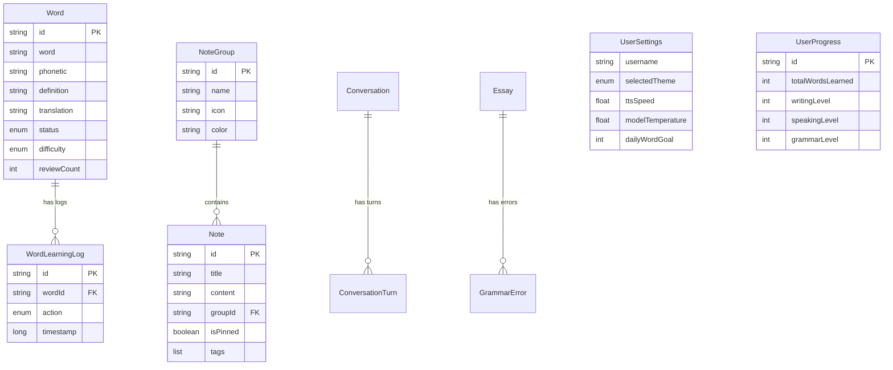

# 数据模型

## Word (单词)

```kotlin
@Entity(tableName = "words")
data class Word(
    @PrimaryKey val id: String = UUID.randomUUID().toString(),
    val word: String,
    val phonetic: String,
    val definition: String,
    val translation: String,
    val exampleSentence: String,
    val difficulty: DifficultyLevel,
    val status: WordStatus = WordStatus.NEW,
    val learningDate: LocalDate,
    val reviewCount: Int = 0,
    val lastReviewDate: LocalDate? = null,
    val createdAt: Long = System.currentTimeMillis(),
    val updatedAt: Long = System.currentTimeMillis()
)

enum class WordStatus {
    NEW, LEARNING, LEARNED, DIFFICULT, MASTERED
}

enum class DifficultyLevel {
    EASY, MEDIUM, HARD, ADVANCED
}
```

### 验证规则
- word字段不能为空且长度在1-50之间
- definition和translation不能为空
- reviewCount必须大于等于0
- learningDate不能是未来日期

---

## Conversation (对话)

```kotlin
@Entity(tableName = "conversations")
data class Conversation(
    @PrimaryKey val id: String = UUID.randomUUID().toString(),
    val topic: String?,
    val startTime: Long = System.currentTimeMillis(),
    val endTime: Long? = null,
    val turnCount: Int = 0,
    val status: ConversationStatus = ConversationStatus.ACTIVE
)

@Entity(tableName = "conversation_turns")
data class ConversationTurn(
    @PrimaryKey val id: String = UUID.randomUUID().toString(),
    val conversationId: String,
    val role: Role,
    val content: String,
    val audioPath: String? = null,
    val timestamp: Long = System.currentTimeMillis(),
    val feedback: SpeakingFeedback? = null
)

enum class Role {
    USER, ASSISTANT
}

enum class ConversationStatus {
    ACTIVE, COMPLETED, PAUSED
}

data class SpeakingFeedback(
    val pronunciation: PronunciationScore,
    val fluency: FluencyScore,
    val grammar: GrammarScore,
    val suggestions: List<String>
)

data class PronunciationScore(
    val score: Float, // 0.0 - 1.0
    val problematicWords: List<String>
)

data class FluencyScore(
    val score: Float,
    val pauseCount: Int,
    val wordsPerMinute: Int
)

data class GrammarScore(
    val score: Float,
    val errors: List<String>
)
```

### 验证规则
- conversationId必须存在于conversations表中
- content不能为空
- timestamp必须在startTime之后
- score值必须在0.0到1.0之间

---

## Essay (作文)

```kotlin
@Entity(tableName = "essays")
data class Essay(
    @PrimaryKey val id: String = UUID.randomUUID().toString(),
    val title: String,
    val content: String,
    val createdAt: Long = System.currentTimeMillis(),
    val updatedAt: Long = System.currentTimeMillis(),
    val wordCount: Int,
    val status: EssayStatus = EssayStatus.DRAFT,
    val lastReview: EssayFeedback? = null
)

enum class EssayStatus {
    DRAFT, REVIEWED, COMPLETED
}

data class EssayFeedback(
    val overallScore: Float, // 0.0 - 100.0
    val grammarErrors: List<GrammarError>,
    val styleComments: List<StyleComment>,
    val vocabularyScore: Float,
    val coherenceScore: Float,
    val suggestions: List<String>,
    val strengths: List<String>,
    val weaknesses: List<String>
)

data class GrammarError(
    val id: String = UUID.randomUUID().toString(),
    val startIndex: Int,
    val endIndex: Int,
    val errorType: ErrorType,
    val message: String,
    val suggestions: List<Suggestion>,
    val severity: Severity
)

enum class ErrorType {
    SPELLING, GRAMMAR, PUNCTUATION, WORD_CHOICE, SENTENCE_STRUCTURE
}

enum class Severity {
    LOW, MEDIUM, HIGH
}

data class Suggestion(
    val text: String,
    val explanation: String,
    val confidence: Float
)

data class StyleComment(
    val startIndex: Int,
    val endIndex: Int,
    val comment: String,
    val category: StyleCategory
)

enum class StyleCategory {
    CLARITY, CONCISENESS, TONE, FORMALITY, REDUNDANCY
}
```

### 验证规则
- title不能为空且长度在1-200之间
- content不能为空
- wordCount必须大于0
- startIndex和endIndex必须在content范围内
- startIndex必须小于endIndex
- confidence值必须在0.0到1.0之间

---

## UserProgress (用户进度)

```kotlin
@Entity(tableName = "user_progress")
data class UserProgress(
    @PrimaryKey val id: String = "singleton",
    val totalWordsLearned: Int = 0,
    val totalConversations: Int = 0,
    val totalEssays: Int = 0,
    val currentStreak: Int = 0,
    val longestStreak: Int = 0,
    val lastActiveDate: LocalDate? = null,
    val level: Int = 1,
    val experiencePoints: Int = 0
)
```

### 验证规则
- 所有计数字段必须大于等于0
- currentStreak不能大于longestStreak
- level必须大于0


---

## Note (笔记)

```kotlin
@Entity(tableName = "notes")
data class Note(
    @PrimaryKey val id: String = UUID.randomUUID().toString(),
    val title: String,
    val content: String,
    val groupId: String? = null,
    val isPinned: Boolean = false,
    val createdAt: Long = System.currentTimeMillis(),
    val updatedAt: Long = System.currentTimeMillis(),
    val tags: List<String> = emptyList()
)

@Entity(tableName = "note_groups")
data class NoteGroup(
    @PrimaryKey val id: String = UUID.randomUUID().toString(),
    val name: String,
    val icon: String = "📁",
    val color: String = "#6366F1",
    val createdAt: Long = System.currentTimeMillis()
)
```

### 验证规则
- title不能为空且长度在1-200之间
- content不能为空
- groupId如果不为null，必须存在于note_groups表中
- tags列表中每个标签长度不超过50字符
- icon必须是有效的emoji字符
- color必须是有效的十六进制颜色代码

---

## UserSettings (用户设置)

```kotlin
data class UserSettings(
    // 用户信息
    val username: String = "用户",
    val avatarPath: String? = null,
    
    // 主题设置
    val selectedTheme: AppTheme = AppTheme.DARK,
    
    // TTS设置
    val ttsVoice: String = "default",
    val ttsSpeed: Float = 1.0f,
    val ttsVolume: Float = 1.0f,
    
    // AI模型设置
    val modelTemperature: Float = 0.7f,
    val modelMaxTokens: Int = 512,
    val modelTopP: Float = 0.9f,
    
    // 学习设置
    val learningReminderEnabled: Boolean = true,
    val dailyWordGoal: Int = 20,
    val dailyStudyMinutes: Int = 30,
    val reminderTime: String = "20:00",
    val reminderDays: Set<DayOfWeek> = setOf(
        DayOfWeek.MONDAY, DayOfWeek.TUESDAY, DayOfWeek.WEDNESDAY,
        DayOfWeek.THURSDAY, DayOfWeek.FRIDAY
    ),
    
    // 自动朗读设置
    val autoReadTextEnabled: Boolean = true,
    val autoReadWordsEnabled: Boolean = true,
    val autoReadGrammarEnabled: Boolean = true,
    val autoReadDays: Set<DayOfWeek> = setOf(
        DayOfWeek.MONDAY, DayOfWeek.TUESDAY, DayOfWeek.WEDNESDAY,
        DayOfWeek.THURSDAY, DayOfWeek.FRIDAY
    ),
    val autoReadTime: String = "20:00",
    
    // UI状态
    val dataManagementExpanded: Boolean = false
)

enum class AppTheme {
    LIGHT,          // 白色主题
    DARK,           // 暗色主题
    APPLE_GREEN,    // 苹果绿主题
    BRIGHT_PURPLE   // 亮紫主题
}

enum class DayOfWeek {
    MONDAY, TUESDAY, WEDNESDAY, THURSDAY, FRIDAY, SATURDAY, SUNDAY
}
```

### 验证规则
- username长度在1-50之间
- ttsSpeed范围为0.5-2.0
- ttsVolume范围为0.0-1.0
- modelTemperature范围为0.0-2.0
- modelMaxTokens范围为1-2048
- modelTopP范围为0.0-1.0
- dailyWordGoal必须大于0
- dailyStudyMinutes必须大于0
- reminderTime格式为"HH:mm"（24小时制）
- autoReadTime格式为"HH:mm"（24小时制）

---

## WordLearningLog (单词学习日志)

```kotlin
@Entity(tableName = "word_learning_logs")
data class WordLearningLog(
    @PrimaryKey val id: String = UUID.randomUUID().toString(),
    val wordId: String,
    val action: LogAction,
    val timestamp: Long = System.currentTimeMillis(),
    val details: String? = null
)

enum class LogAction {
    LEARNED,        // 标记为已学
    REVIEWED,       // 复习
    BOOKMARKED,     // 收藏
    PRONUNCIATION,  // 播放发音
    SWIPE_LEFT,     // 左滑（未记住）
    SWIPE_RIGHT     // 右滑（已记住）
}
```

### 验证规则
- wordId必须存在于words表中
- timestamp不能是未来时间
- details长度不超过500字符

---

## 数据模型关系图



---

## 数据持久化策略

### Room Database
用于存储结构化数据：
- Word（单词）
- Conversation & ConversationTurn（对话）
- Essay（作文）
- Note & NoteGroup（笔记）
- WordLearningLog（学习日志）
- UserProgress（用户进度）

### DataStore
用于存储用户设置（替代SharedPreferences）：
- UserSettings（所有用户设置）
- 主题选择
- TTS配置
- AI模型参数
- 学习提醒设置
- 自动朗读设置

### 文件存储
用于存储大文件：
- 用户头像（avatarPath）
- 对话音频（audioPath）
- AI模型文件（GGUF格式）
- 导出的数据文件（JSON/CSV）

---

## 数据迁移策略

### 版本1 → 版本2
添加新表：
- notes
- note_groups
- word_learning_logs

添加新字段到 user_progress：
- writingLevel
- speakingLevel
- grammarLevel

### 迁移代码示例
```kotlin
val MIGRATION_1_2 = object : Migration(1, 2) {
    override fun migrate(database: SupportSQLiteDatabase) {
        // 创建笔记表
        database.execSQL("""
            CREATE TABLE IF NOT EXISTS notes (
                id TEXT PRIMARY KEY NOT NULL,
                title TEXT NOT NULL,
                content TEXT NOT NULL,
                groupId TEXT,
                isPinned INTEGER NOT NULL DEFAULT 0,
                createdAt INTEGER NOT NULL,
                updatedAt INTEGER NOT NULL
            )
        """)
        
        // 创建笔记分组表
        database.execSQL("""
            CREATE TABLE IF NOT EXISTS note_groups (
                id TEXT PRIMARY KEY NOT NULL,
                name TEXT NOT NULL,
                icon TEXT NOT NULL DEFAULT '📁',
                color TEXT NOT NULL DEFAULT '#6366F1',
                createdAt INTEGER NOT NULL
            )
        """)
        
        // 创建学习日志表
        database.execSQL("""
            CREATE TABLE IF NOT EXISTS word_learning_logs (
                id TEXT PRIMARY KEY NOT NULL,
                wordId TEXT NOT NULL,
                action TEXT NOT NULL,
                timestamp INTEGER NOT NULL,
                details TEXT,
                FOREIGN KEY(wordId) REFERENCES words(id) ON DELETE CASCADE
            )
        """)
        
        // 添加新字段到用户进度表
        database.execSQL("""
            ALTER TABLE user_progress 
            ADD COLUMN writingLevel INTEGER NOT NULL DEFAULT 0
        """)
        database.execSQL("""
            ALTER TABLE user_progress 
            ADD COLUMN speakingLevel INTEGER NOT NULL DEFAULT 0
        """)
        database.execSQL("""
            ALTER TABLE user_progress 
            ADD COLUMN grammarLevel INTEGER NOT NULL DEFAULT 0
        """)
    }
}
```
